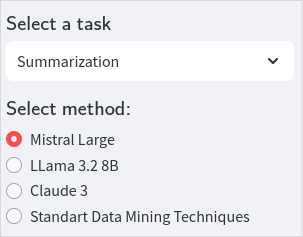
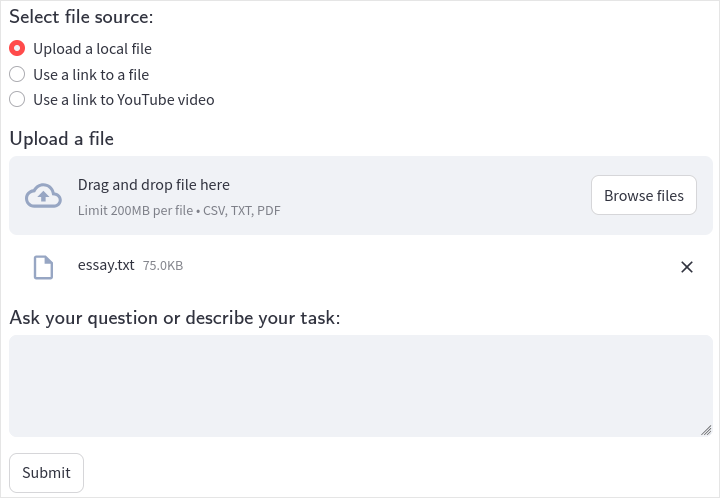
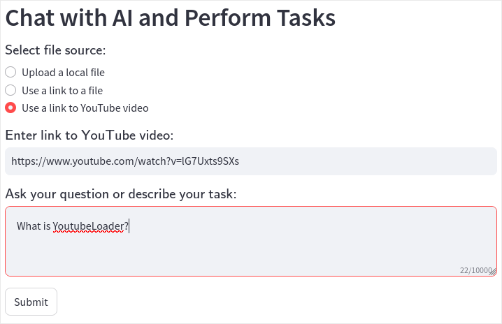
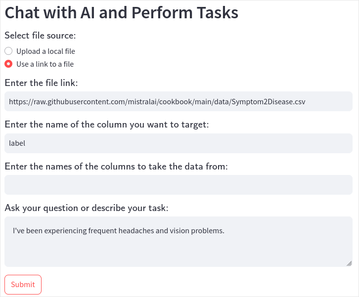

# **LLM для data mining**

Система для вирішення завдань data mining використанням великих мовних моделей (LLM). Цей репозиторій досліджує інтеграцію сучасних мовних моделей для ефективної обробки, аналізу та візуалізації даних.

### Веб-застосунок функціонує та доступний за [посиланням](https://llm-for-data-mining.streamlit.app/)

---

## **Зміст**
1. [Можливості](#можливості)
2. [Встановлення](#встановлення)
3. [Використання](#використання)
5. [Приклади](#приклади)
6. [Контакти](#контакти)

---

## **Можливості**
- Використання LLM для виконання різних завдань добування даних, таких як:
  - Підсумовування (Summarization)
  - Класифікація
  - Кластеризація
  - Регресійний аналіз
  - Кореляційний аналіз
  - Візуалізація даних
- Розширювана архітектура для створення нових робочих процесів.
- Інтерактивний інтерфейс на основі `streamlit` для зручного тестування та розгортання.

---

## **Встановлення**

1. Клонувати репозиторій:
   ```bash
   git clone https://github.com/YaroslavPanasiuk/LLM-for-data-mining.git
   cd LLM-for-data-mining
   ```

2. Запустити файл ```run.ps1``` (Windows) або  ```run.sh``` (Linux). Цей файл має автоматично створити віртуальне середовище python, встановити всі залежності та запустити веб-додаток. Якщо це не працює, можна зробити це вручну (описано в наступних кроках)

3. Створити віртуальне середовище та активувати його:
   ```bash
   python -m venv venv
   .\venv\Scripts\activate  # У Linux: source venv/bin/activate
   ```

4. Встановити необхідні залежності:
   ```bash
   pip install -r requirements.txt
   ```

5. Запустити додаток:
   ```bash
   streamlit run main.py
   ```

---

## **Використання**

1. Підготуйте свій набір даних у форматі CSV, PDF або TXT.
2. Запустіть додаток Streamlit:
   ```bash
   streamlit run main.py
   ```
3. Використовуйте додаток для:
   - Завантаження набору даних.
   - Вибору завдань для добування даних.
   - Перегляду оброблених результатів і отриманих інсайтів.

Для детальних прикладів дивіться розділ [Приклади](#приклади).

---

## **Приклади**

1. ### Підсумовування тексту:
    - Оберіть завдання "Summarization" та метод "Mistral Large":
    
    - Завантажте файл [Essay.txt](https://github.com/YaroslavPanasiuk/LLM-for-data-mining/blob/master/data_examples/essay.txt) у поле для завантажень файлів:
    
    - Натисніть кнопку Submit
    - Очікуйте результату (це може зайняти до 2 хвилин часу)

2. ### Підсумовування відео:
    - Оберіть завдання "Summarization" та метод "Mistral Large", в полі "Select file source" оберіть "Use a link to YouTube video":
    - Вставте посилання на будь-яке аноломовне відео (наприклад, "https://www.youtube.com/watch?v=lG7Uxts9SXs"):
    - Введіть будь-яке запитання про вміст відео англійською мовою (наприклад, "What is YoutubeLoader?") у відповідне поле, або залишіть його пустим
    
    - Тисніть кнопку Submit
    - Очікуйте результату (це може зайняти до 2 хвилин часу). Mistral на основі вмісту відео відповість на задане запитання

3. ### Класифікація датасету:
    - Оберіть завдання "Classification" та метод "Mistral Large", в полі "Select file source" оберіть Use a link to a file:
    - Вставте посилання "https://raw.githubusercontent.com/mistralai/cookbook/main/data/Symptom2Disease.csv" у відповідне поле:
    - Введіть слово "label" у поле "Enter the name of the column you want to target:"
    - Поле "Enter the names of the columns to take the data from:" залишіть пустим, а в полі "Ask your question or describe your task:" напишіть симптоми хвороби англійською мовою, наприклад, "I've been experiencing frequent headaches and vision problems."
    
    - Тисніть кнопку Submit
    - Очікуйте результату (це може зайняти до 3 хвилин часу). Mistral на основі датасету визначть діагноз відповідно до симптомів, записаних вами вище

### Можете експериментувати з налаштуваннями та завданнями, бажаю успіхів :)

---

## **Контакти**

Якщо у вас є питання або пропозиції, відкрийте issue або зв’яжіться з відповідальним за репозиторій:
- **Відповідальний**: Ярослав Панасюк
- **Email**: [yaroslav.panasiuk.1902@gmail.com]

---
